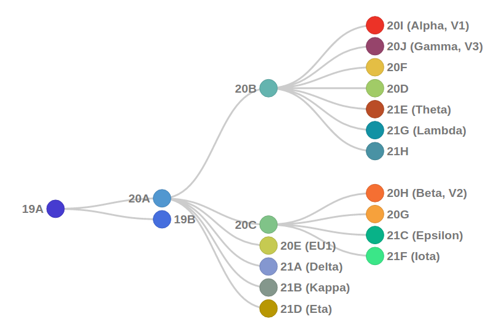

```{r setup, include=FALSE}
knitr::opts_chunk$set(echo = TRUE)
```

```{r message = FALSE, include = FALSE}
library(tidyverse)
options(dplyr.summarise.inform = FALSE)
library(lubridate)
library(DBI)
library(ggpubr)
library(ggstatsplot)
library(car)
library(rstatix)
library(zoo)
library(kableExtra)
library(moments)
set.seed(100)
```

# Outline

1.  Extract clade assignment results for the sequenced samples.
2.  Extract sample collection information for COVID +ve samples, and exclude samples with missing collection date or patient ID.
3.  Retain only the first COVID +ve sample collected from a patient (Prior infection could potentially affect Ct for subsequent reinfections.)

The following steps are done A) considering samples from all order priority statuses, or B) only retaining surveillance samples.

4.  Draw a stacked bar plot to represent clade composition among sequenced samples collected during every month of 2021.
5.  Determine mean Ct values for N and RNase P genes. If Ct RNase P is missing, impute median values for samples belonging to the same clade.
6.  Retain only samples classified with the following clades:

```
    21A (Delta)
    20I (Alpha, V1)
    20J (Gamma, V3)
    20G
```          

7.  Perform statistical tests to compare Ct values for N and RNase P genes between different clades.

# Clade Assignment Results

```{r include = FALSE}
db_build <- dbConnect(RSQLite::SQLite(), "deidentifiedDB_v2021.12.22.sqlite")
viralrecon_table <- dbReadTable(db_build, "viralrecon")
diagnostics_table <- dbReadTable(db_build, "diagnostics")
demographics_table <- dbReadTable(db_build, "demographics")
sample_collection_table <- dbReadTable(db_build, "sample_collection")
dhec_table <- dbReadTable(db_build, "dhec")
gisaid_table <- dbReadTable(db_build, "gisaid")
genbank_table <- dbReadTable(db_build, "genbank")
dbDisconnect(db_build)
```

Samples were sent to Premier Medical Services and LabCorp during the course of the year 2021, to get clade and lineage assigned to the samples.

Since these two vendors used different pipelines, in order to maintain consistency, CUGBF reran the SARS-CoV-2 sequence analysis on all samples using the `nf-core/viralrecon` pipeline.

A table `viralrecon_clade` was prepared with `testkit_id`s and `clade` assignment results from `nf-core/viralrecon`.

```{r}
viralrecon_table <- viralrecon_table %>%
  mutate(run_date_time = date(as_datetime(run_date_time))) %>%
  filter(run_date_time != "2021-12-18")

glimpse(viralrecon_table)
```

```{r}
clade_assignments <- viralrecon_table %>%
  select(testkit_id, clade) %>%
  drop_na() %>%
  mutate(pipeline = "nf-core/viralrecon") %>%
  distinct()

glimpse(clade_assignments)
```

Are there any `testkit_id`s with multiple clade assignments ?

```{r}
clade_assignments %>%
  group_by(testkit_id) %>%
  filter(n() > 1)
```

## Exclude Sample without `patient_id` or `collection_date`, and only retain COVID +ve `testkit_id`s

In the upcoming steps, we only include the first COVID +ve sample isolated from each patient, and in order to not compromise that step, `testkit_id`s with missing `patient_id` and `collection_date` were excluded from further analysis. Also, the `gender` information is required.

```{r}
sample_collection_without_missing <- sample_collection_table %>%
  filter(
    rymedi_result == "POSITIVE",
    !(is.na(collection_date) | is.na(patient_id)),
    !(is.na(gender))
  ) %>%
  mutate(
    collection_date = as_datetime(collection_date),
    result_date = as_date(result_date)
  )

glimpse(sample_collection_without_missing)
```

## Retain only the 1st COVID19 +ve test from a Patient.

Multiple samples were tested from numerous patients during the course of their infection, and many such samples were sequenced. Having multiple COVID19 +ve from a single patient during a single infection event, could affect assumption of independence used for statistical analysis later. Also, prior infection could potentially affect Ct for subsequent reinfections.

```{r}
sample_collection_without_missing %>%
  group_by(patient_id) %>%
  filter(n() > 1) %>%
  arrange(patient_id, collection_date) %>%
  select(testkit_id, collection_date, patient_id) %>%
  ungroup() %>%
  slice(1:15) %>%
  kbl() %>%
  kable_classic_2(
    full_width = F,
    latex_options = c(
      "hold_position",
      "striped"
    )
  )
```

```{r}
not_first_covid_positive_samples <- sample_collection_without_missing %>%
  filter(rymedi_result == "POSITIVE") %>%
  group_by(patient_id) %>%
  filter(n() > 1) %>%
  select(testkit_id, patient_id, collection_date) %>%
  arrange(patient_id, collection_date) %>%
  slice(2:n()) %>%
  pull(testkit_id)

glimpse(not_first_covid_positive_samples)
```

Therefore, only the first COVID19 +ve sample from patients are considered for further analysis.

```{r}
sample_collection_without_missing <- sample_collection_without_missing %>%
  filter(!(testkit_id %in% not_first_covid_positive_samples))

glimpse(sample_collection_without_missing)
```

```{r include = FALSE}
map(
  sample_collection_without_missing %>%
    select(
      rymedi_result,
      population,
      order_priority,
      gender,
      pregnancy_status
    ),
  unique
)
```

## Join `sample_collection` Information

In this step, we join the sample collection information with the `clade_assignments` table described previously, and we name the output table as `clades_and_collection`.

```{r}
clades_and_collection <- clade_assignments %>%
  inner_join(sample_collection_without_missing,
    by = "testkit_id"
  ) %>%
  mutate(collection_date = date(collection_date)) %>%
  select(
    patient_id, testkit_id, collection_date, clade, population, order_priority, gender,
    pregnancy_status, pipeline, rymedi_result
  ) %>%
  arrange(patient_id, collection_date)

clades_and_collection <- clades_and_collection %>%
  mutate(
    population = factor(population,
      levels = c(
        "UNIVERSITY",
        "ATHLETICS",
        "COMMUNITY",
        "TRICOUNTY"
      )
    ),
    order_priority = factor(order_priority,
      levels = c(
        "SURVEILLANCE",
        "SYMPTOMATIC",
        "EXPOSED",
        "ONE DAY"
      )
    ),
    gender = factor(gender,
      levels = c("M", "F")
    ),
    pregnancy_status = factor(pregnancy_status,
      levels = c("YES", "NO")
    ),
    clade = as_factor(clade),
    rymedi_result = factor(rymedi_result,
      levels = c("POSITIVE")
    ),
    pipeline = as_factor(pipeline)
  ) %>%
  arrange(collection_date, order_priority, population)

glimpse(clades_and_collection)
```

The following are the range of responses to columns in the `clades_and_collection` table.

```{r}
map(
  clades_and_collection %>% select(
    population, order_priority, gender,
    pregnancy_status, rymedi_result, clade, pipeline
  ),
  unique
)
```

# Exploratory Data Analysis

In this step we take a visual glimpse of the `clades_and_collection` table.

```{r}
summary(clades_and_collection)
```

```{r warning = FALSE, fig.width = 7, fig.height = 5, fig.align='center'}
clades_and_collection %>%
  group_by(gender) %>%
  summarise(count = n()) %>%
  ggbarplot(
    x = "gender",
    y = "count",
    fill = "gender"
  )
```

```{r warning = FALSE, fig.width = 7, fig.height = 5, fig.align='center'}
clades_and_collection %>%
  group_by(order_priority, gender) %>%
  summarise(count = n()) %>%
  ggbarplot(
    x = "order_priority",
    y = "count",
    fill = "gender"
  )
```

```{r warning = FALSE, fig.width = 7, fig.height = 5, fig.align='center'}
clades_and_collection %>%
  group_by(population, gender) %>%
  summarise(count = n()) %>%
  ggbarplot(
    x = "population",
    y = "count",
    fill = "gender"
  )
```

```{r warning = FALSE, fig.width = 7, fig.height = 5, fig.align='center'}
ggdensity(clades_and_collection,
  x = "collection_date",
  color = "gender"
)
```

```{r}
ggdensity(clades_and_collection,
  x = "collection_date",
  color = "population"
)
```

```{r warning = FALSE, fig.width = 7, fig.height = 5, fig.align='center'}
ggdensity(clades_and_collection,
  x = "collection_date",
  color = "order_priority"
)
```

# Clade definition from NextClade

Since clades in this study follow the nomenclature set by the NextClade team, it is useful to learn the phylogenetic relations between the clades.



The upcoming steps are performed

A)  considering samples from all order priority statuses, or

B)  only retaining surveillance samples.

# Pooling Samples across `order_priority` Statuses

## Bar Plots with Monthly Count for each Clade

The clades present in `clades_and_collection` when all `order_priority` statuses are considered are as follows:

```{r}
clades_factor_level <- clades_and_collection %>%
  group_by(clade) %>%
  summarize(count = n()) %>%
  pull(clade)

(clades_factor_level <- sort(as.character(clades_factor_level)))
```

From `clades_and_collection`, we tabulate the count of each clade among sequenced samples collected in each month of 2021.

```{r}
monthly_clade_date <- clades_and_collection %>%
  mutate(
    collection_period = as.yearmon(collection_date),
    clade = factor(clade,
      levels = clades_factor_level
    )
  ) %>%
  group_by(collection_period, clade) %>%
  summarize(count = n())

glimpse(monthly_clade_date)
```

```{r include = FALSE}
# https://stackoverflow.com/questions/9563711/r-color-palettes-for-many-data-classes
# "dodgerblue2", "#E31A1C", "green4", "#6A3D9A", "#FF7F00", "gold1", "skyblue2", "palegreen2", "#FDBF6F", "gray70", "maroon", "orchid1", "darkturquoise", "darkorange4", "brown"
my_palette <- c("skyblue2", "maroon", "gold1", "palegreen2", "#FDBF6F", "dodgerblue2", "gray70", "#E31A1C", "green4", "#6A3D9A", "#FF7F00", "orchid1", "darkturquoise", "darkorange4", "brown")

length(my_palette) >= length(clades_factor_level)
```

```{r include = FALSE}
color_tbl <- tibble(
  clade = clades_factor_level,
  color = my_palette[1:length(clades_factor_level)]
)
glimpse(color_tbl)
```

Visualizing the table above using a stacked bar plot.

```{r warning = FALSE, fig.width = 7, fig.height = 5, fig.align='center'}
ggplot(
  monthly_clade_date,
  aes(
    x = collection_period,
    y = count,
    fill = clade
  )
) +
  geom_bar(colour = "black", position = "stack", stat = "identity") +
  scale_x_yearmon(breaks = monthly_clade_date$collection_period) +
  scale_fill_manual(values = color_tbl %>%
    filter(clade %in% monthly_clade_date$clade) %>%
    pull(color)) +
  labs(
    y = "Number of Sequenced Samples",
    x = "Sample Collection Period"
  ) +
  theme_pubclean() +
  theme(
    legend.position = "right",
    legend.title = element_blank(),
    legend.key.size = unit(0.5, "cm"),
    axis.text.x = element_text(angle = 45, vjust = 1, hjust = 1)
  )
```

```{r warning = FALSE,include = FALSE}
tiff("Figure1.tiff", units="in", width=8, height=5, res=300)
ggplot(
  monthly_clade_date,
  aes(
    x = collection_period,
    y = count,
    fill = clade
  )
) +
  geom_bar(colour = "black", position = "stack", stat = "identity") +
  scale_x_yearmon(breaks = monthly_clade_date$collection_period) +
  scale_fill_manual(values = color_tbl %>%
    filter(clade %in% monthly_clade_date$clade) %>%
    pull(color)) +
  labs(
    y = "Number of Sequenced Samples",
    x = "Sample Collection Period"
  ) +
  theme_pubclean() +
  theme(
    legend.position = "right",
    legend.title = element_blank(),
    legend.key.size = unit(0.5, "cm"),
    axis.text.x = element_text(angle = 45, vjust = 1, hjust = 1)
  )
dev.off()
```

```{r warning = FALSE, fig.width = 7, fig.height = 5, fig.align='center'}
ggplot(
  monthly_clade_date,
  aes(
    x = collection_period,
    y = count,
    fill = clade
  )
) +
  geom_col(colour = "black", position = "fill") +
  scale_y_continuous(labels = scales::percent) +
  scale_x_yearmon(breaks = monthly_clade_date$collection_period) +
  scale_fill_manual(values = color_tbl %>%
    filter(clade %in% monthly_clade_date$clade) %>%
    pull(color)) +
  labs(
    y = "% Sequenced Samples",
    x = "Sample Collection Period"
  ) +
  theme_pubclean() +
  theme(
    legend.position = "right",
    legend.title = element_blank(),
    legend.key.size = unit(0.5, "cm"),
    axis.text.x = element_text(angle = 45, vjust = 1, hjust = 1)
  )
```

## Preparing `diagnostics` data

Our goal is to determine whether 21A (Delta) shows lower Ct values for N gene when compared with the clades 20I (Alpha, V1), 20G, and 20J (Gamma, V3). In order to know that, we use the Ct values for N gene from the REDDI lab dataset. Since two replicates were done for each qRT-PCR reaction, we will compute the mean Ct for N gene and RNase P control for each `testkit_id`

```{r}
# diagnostics_data
diagnostics_data <- diagnostics_table %>%
  filter(testkit_id %in% clades_and_collection$testkit_id) %>%
  select(testkit_id, ct_rnasep_rep1, ct_rnasep_rep2, ct_N_rep1, ct_N_rep2) %>%
  arrange(testkit_id) %>%
  mutate(
    average_ct_rnasep = rowMeans(.[, c("ct_rnasep_rep1", "ct_rnasep_rep2")], na.rm = TRUE),
    average_ct_N = rowMeans(.[, c("ct_N_rep1", "ct_N_rep2")], na.rm = TRUE)
  ) %>%
  select(-c(
    ct_rnasep_rep1, ct_rnasep_rep2,
    ct_N_rep1, ct_N_rep2
  )) %>%
  group_by(testkit_id) %>%
  summarise(
    ct_RNaseP = mean(average_ct_rnasep, na.rm = TRUE),
    ct_N = mean(average_ct_N, na.rm = TRUE)
  )

diagnostics_data %>%
  filter(!complete.cases(.)) %>%
  kbl() %>%
  kable_classic_2(
    full_width = F,
    latex_options = c(
      "hold_position",
      "striped"
    )
  )
```

35 `testkit_id`s do not have a ct value for RNase P. We will use imputation to deal with the missing values.

## Join `clade_assignments` and `diagnostics_data`

We join `clades_and_collection` and the diagnostics data to get the `clade_collection_diagnostics` table.

```{r}
clade_collection_diagnostics <- clades_and_collection %>%
  inner_join(diagnostics_data, by = "testkit_id")

glimpse(clade_collection_diagnostics)
```

Since many samples had missing Ct values for RNase P, we impute median value of `ct_RNaseP` for each clade to the missing values.

```{r}
get_median_ct <- function(input_clade) {
  median_RNAseP <- clade_collection_diagnostics %>%
    filter(clade == input_clade) %>%
    pull(ct_RNaseP) %>%
    median(na.rm = TRUE)

  return(median_RNAseP)
}
```

Median Ct RNase P - 20I (Alpha, V1)

```{r}
# 20I (Alpha, V1)
(median_RNAseP_20I <- get_median_ct("20I (Alpha, V1)"))
```

Median Ct RNase P - 21A (Delta)

```{r}
# 21A (Delta)
(median_RNAseP_21A <- get_median_ct("21A (Delta)"))
```

Median Ct RNase P - 20G

```{r}
# 20G
(median_RNAseP_20G <- get_median_ct("20G"))
```

Median Ct RNase P - 20J (Gamma, V3)

```{r}
# 20J (Gamma, V3)
(median_RNAseP_20J <- get_median_ct("20J (Gamma, V3)"))
```

Summary of the `clade_collection_diagnostics` table after imputation

```{r}
clade_collection_diagnostics <- clade_collection_diagnostics %>%
  mutate(
    ct_RNaseP = replace(
      ct_RNaseP,
      (is.na(ct_RNaseP) & (clade == "20I (Alpha, V1)")), median_RNAseP_20I
    ),
    ct_RNaseP = replace(
      ct_RNaseP,
      (is.na(ct_RNaseP) & (clade == "21A (Delta)")), median_RNAseP_21A
    ),
    ct_RNaseP = replace(
      ct_RNaseP,
      (is.na(ct_RNaseP) & (clade == "20G")), median_RNAseP_20G
    ),
    ct_RNaseP = replace(
      ct_RNaseP,
      (is.na(ct_RNaseP) & (clade == "20J (Gamma, V3)")), median_RNAseP_20J
    )
  )

summary(clade_collection_diagnostics)
```

The counts of different clades in the `clade_collection_diagnostics` table are as follows:

```{r}
clade_collection_diagnostics %>%
  group_by(clade) %>%
  summarize(count = n()) %>%
  arrange(desc(count)) %>%
  kbl() %>%
  kable_classic_2(
    full_width = F,
    latex_options = c(
      "hold_position",
      "striped"
    )
  )
```

## Data Accessibility

```{r}
data_access_table <- clade_collection_diagnostics %>%
  mutate(
    ct_N = round(ct_N, 3),
    ct_RNaseP = round(ct_RNaseP, 3),
    sample_id = str_sub(testkit_id,
      start = 8L
    )
  ) %>%
  select(sample_id, collection_date, order_priority, clade, ct_N, ct_RNaseP) %>%
  rename(
    `Mean Ct : N gene` = "ct_N",
    `Mean Ct : RNase P gene` = "ct_RNaseP"
  ) %>%
  arrange(collection_date, order_priority, clade, `Mean Ct : N gene`)

glimpse(data_access_table)
```

```{r}
write_csv(
  data_access_table,
  "data_accessibility_table.csv"
)
```


In order to not affect our assumption of phylogenetic independence, we are only going to compare Ct values for variants at terminal nodes of NextClade tree. We extract data from `clade_collection_diagnostics` table and create a new table `limited_clade_collection_diagnostics` with only data for the following clades:

        21A (Delta)
        20I (Alpha, V1)
        20J (Gamma, V3)
        20G

```{r}
limited_clade_collection_diagnostics <- clade_collection_diagnostics %>%
  filter(clade %in% c(
    "21A (Delta)",
    "20I (Alpha, V1)",
    "20J (Gamma, V3)",
    "20G"
  )) %>%
  mutate(clade = factor(clade,
    levels = c(
      "20G",
      "20I (Alpha, V1)",
      "20J (Gamma, V3)",
      "21A (Delta)"
    )
  )) %>%
  select(testkit_id, clade, ct_RNaseP, ct_N) %>%
  ungroup() %>%
  drop_na()

glimpse(limited_clade_collection_diagnostics)
```

Summary of the `limited_clade_collection_diagnostics` table :

```{r}
summary(limited_clade_collection_diagnostics)
```

Median and range of patient age whose samples are in the `limited_clade_collection_diagnostics` table as follows:

```{r}
sample_collection_table %>%
  mutate(collection_date = year(as_datetime(collection_date))) %>%
  filter(testkit_id %in% limited_clade_collection_diagnostics$testkit_id) %>%
  left_join(demographics_table, by = "patient_id") %>%
  mutate(age_at_sample_collection = (collection_date - birth_year)) %>%
  select(testkit_id, patient_id, age_at_sample_collection) %>%
  summarize(
    median_age_at_sample_collection = median(age_at_sample_collection),
    lowest_age_at_sample_collection = min(age_at_sample_collection),
    highest_age_at_sample_collection = max(age_at_sample_collection)
  ) %>%
  kbl() %>%
  kable_classic_2(
    full_width = F,
    latex_options = c(
      "hold_position",
      "striped"
    )
  )
```

The counts of each gender in the `limited_clade_collection_diagnostics` table are as follows:

```{r}
sample_collection_table %>%
  filter(testkit_id %in% limited_clade_collection_diagnostics$testkit_id) %>%
  group_by(gender) %>%
  summarize(count = n()) %>%
  kbl() %>%
  kable_classic_2(
    full_width = F,
    latex_options = c(
      "hold_position",
      "striped"
    )
  )
```

The median, IQR and range of Ct values for each clade in the `limited_clade_collection_diagnostics` table are as follows:

```{r}
limited_clade_collection_diagnostics %>%
  group_by(clade) %>%
  summarise(
    count = n(),
    median_ct_N = round(median(ct_N), 3),
    IQR_ct_N = round(IQR(ct_N), 3),
    min_ct_N = round(range(ct_N)[1], 3),
    max_ct_N = round(range(ct_N)[2], 3)
  ) %>%
  kbl() %>%
  kable_classic_2(
    latex_options = c(
      "hold_position",
      "striped",
      "scale_down"
    )
  )
```

```{r}
limited_clade_collection_diagnostics %>%
  group_by(clade) %>%
  summarise(
    count = n(),
    median_ct_RNaseP = round(median(ct_RNaseP), 3),
    IQR_ct_RNaseP = round(IQR(ct_RNaseP), 3),
    min_ct_RNaseP = round(range(ct_RNaseP)[1], 3),
    max_ct_RNaseP = round(range(ct_RNaseP)[2], 3)
  ) %>%
  kbl() %>%
  kable_classic_2(
    latex_options = c(
      "hold_position",
      "striped",
      "scale_down"
    )
  )
```

The median, IQR, and range of Ct values for each `clade` - `order_priority` combination in the `limited_clade_collection_diagnostics` table are as follows:

```{r}
limited_clade_collection_diagnostics %>%
  inner_join(sample_collection_without_missing %>%
    select(testkit_id, order_priority),
  by = "testkit_id"
  ) %>%
  group_by(clade, order_priority) %>%
  summarise(
    count = n(),
    median_ct_N = round(median(ct_N), 3),
    IQR_ct_N = round(IQR(ct_N), 3),
    median_ct_RNaseP = round(median(ct_RNaseP), 3),
    IQR_ct_RNaseP = round(IQR(ct_RNaseP), 3)
  ) %>%
  kbl() %>%
  kable_classic_2(
    latex_options = c(
      "hold_position",
      "striped",
      "scale_down"
    )
  )
```

```{r}
limited_clade_collection_diagnostics %>%
  inner_join(sample_collection_without_missing %>%
    select(testkit_id, order_priority),
  by = "testkit_id"
  ) %>%
  group_by(clade, order_priority) %>%
  summarise(
    count = n(),
    mean_ct_N = round(mean(ct_N), 3),
    min_ct_N = round(range(ct_N)[1], 3),
    max_ct_N = round(range(ct_N)[2], 3),
    mean_ct_RNaseP = round(mean(ct_RNaseP), 3),
    min_ct_RNaseP = round(range(ct_RNaseP)[1], 3),
    max_ct_RNaseP = round(range(ct_RNaseP)[2], 3)
  ) %>%
  kbl() %>%
  kable_classic_2(
    latex_options = c(
      "hold_position",
      "striped",
      "scale_down"
    )
  )
```

Exploring if Ct values have any relation with gender

```{r}
lc_age_gender <- limited_clade_collection_diagnostics %>%
  inner_join(sample_collection_table %>%
    select(testkit_id, patient_id, gender, collection_date),
  by = "testkit_id"
  ) %>%
  inner_join(demographics_table %>%
    select(patient_id, birth_year),
  by = "patient_id"
  ) %>%
  mutate(
    collection_date = as_datetime(collection_date),
    gender = factor(gender, levels = c("M", "F")),
    age = year(collection_date) - birth_year,
    age_group = cut(x = age, breaks = c(0, 18, 30, 40, 50, 65, 85, 100))
  )

summary(lc_age_gender)
```

```{r warning = FALSE, fig.width = 8.5, fig.height = 11.5, fig.align='center'}
p <- lc_age_gender %>%
  filter(
    !is.na(gender),
    !is.na(age_group)
  ) %>%
  ggboxplot(
    x = "clade",
    y = "ct_N",
    color = "gender",
    alpha = 0.3,
    add = c("jitter"),
    add.params = list(alpha = 0.25),
  )

p <- facet(p,
  facet.by = "age_group",
  ncol = 2
)

p + rotate_x_text(45)
```

## Compilation of Supplementary Table with Database Accession Numbers

### Clade and Lineage Info

```{r}
glimpse(viralrecon_table)
```

```{r}
clades_lineage_table <- viralrecon_table %>%
  select(testkit_id, lineage, clade) %>%
  filter(!(is.na(lineage) & is.na(clade))) %>%
  distinct() %>%
  arrange(testkit_id)


glimpse(clades_lineage_table)
```

```{r}
selected_clades_lineage_table <- limited_clade_collection_diagnostics %>%
  select(testkit_id) %>%
  left_join(clades_lineage_table, by = "testkit_id") %>%
  select(testkit_id, lineage, clade) %>%
  arrange(testkit_id)

glimpse(selected_clades_lineage_table)
```

### SC DHEC Info

```{r}
glimpse(dhec_table)
```

```{r}
selected_clades_lineage_table <- selected_clades_lineage_table %>%
  left_join(dhec_table %>%
    filter(pipeline == "nf-core/viralrecon"),
  by = "testkit_id"
  ) %>%
  select(testkit_id, dhec_accession, clade, lineage)

glimpse(selected_clades_lineage_table)
```

### GenBank Info

```{r}
glimpse(genbank_table)
```

```{r}
unique(genbank_table$pipeline_used)
```

```{r}
selected_clades_lineage_table <- selected_clades_lineage_table %>%
  left_join(genbank_table %>%
    filter(pipeline_used == "nf-core/viralrecon 2.2"),
  by = "testkit_id"
  ) %>%
  select(testkit_id, dhec_accession, genbank_accession, clade, lineage)

glimpse(selected_clades_lineage_table)
```

### GISAID Info

```{r}
glimpse(gisaid_table)
```

```{r}
selected_clades_lineage_table <- selected_clades_lineage_table %>%
  left_join(gisaid_table %>%
    filter(pipeline_used == "nf-core/viralrecon 2.2"),
  by = "testkit_id"
  ) %>%
  select(testkit_id, dhec_accession, genbank_accession, gisaid_epi_isl, clade, lineage)

glimpse(selected_clades_lineage_table)
```

```{r}
selected_clades_lineage_table <- selected_clades_lineage_table %>%
  mutate(sample_id = str_sub(testkit_id,
    start = 8L
  )) %>%
  relocate(sample_id, .after = testkit_id)

glimpse(selected_clades_lineage_table)
```

### Sample Collection Info

```{r}
imp_sc_info <- sample_collection_table %>%
  filter(testkit_id %in% selected_clades_lineage_table$testkit_id) %>%
  select(testkit_id, collection_date, order_priority) %>%
  mutate(collection_date = date(as_datetime(collection_date)))

glimpse(imp_sc_info)
```

```{r}
selected_clades_lineage_table <- selected_clades_lineage_table %>%
  left_join(imp_sc_info,
    by = "testkit_id"
  ) %>%
  select(testkit_id, sample_id, order_priority, collection_date, dhec_accession, genbank_accession, gisaid_epi_isl, clade, lineage) %>%
  arrange(collection_date, order_priority, sample_id)

glimpse(selected_clades_lineage_table)
```

```{r}
selected_clades_lineage_table <- selected_clades_lineage_table %>%
  mutate(collection_period = as.yearmon(collection_date)) %>%
  select(-c(testkit_id, collection_date))
```

```{r}
selected_clades_lineage_table %>%
  group_by(sample_id) %>%
  filter(n() > 1)
```

```{r}
glimpse(selected_clades_lineage_table)
```

```{r}
selected_clades_lineage_table %>%
  mutate(
    collection_period = as.character(collection_period),
    across(.cols = c(
      "order_priority", "collection_period",
      "clade", "lineage"
    ), as_factor)
  ) %>%
  summary()
```

### Final Formatting

```{r}
selected_clades_lineage_table <- selected_clades_lineage_table %>%
  mutate(collection_period = as.character(collection_period)) %>%
  rename(
    `Sample ID` = "sample_id",
    `Collection Period` = "collection_period",
    `Priority Status` = "order_priority",
    `SC DHEC Accession` = "dhec_accession",
    `GenBank Accession` = "genbank_accession",
    `GISAID Accession` = "gisaid_epi_isl",
    Clade = "clade",
    Lineage = "lineage"
  )
```

```{r}
write_csv(selected_clades_lineage_table, "supplementary_table_1.csv")
```

## N gene

### Assumptions

#### Independence

No two samples came from the same `patient_id`. The samples are from Clemson University's COVID19 testing program. The CU REDDI lab chose samples that were sent for sequencing.

#### Normality :

##### Histogram of Residuals

```{r warning = FALSE, fig.width = 7, fig.height = 5, fig.align='center'}
res_aov_n <- aov(ct_N ~ clade,
  data = limited_clade_collection_diagnostics
)

hist(res_aov_n$residuals)
```

The histogram shows a slightly left skewed distribution.

##### QQ-Plot of Residuals

```{r warning = FALSE, fig.width = 7, fig.height = 5, fig.align='center'}
qqPlot(res_aov_n$residuals,
  id = FALSE
)
```

##### Shapiro-Wilk

> Null Hypothesis: Data comes from a normal distribution.

> Alternate Hypothesis: Data does not come from a normal distribution.

```{r}
shapiro.test(res_aov_n$residuals)
```

*Since p-value \< 0.05, we reject the null hypothesis. The data does not follow a normal distribution.*

*We will perform Kruskal-Wallis Test to compare the Ct values for N gene between the different SARS-CoV-2 clades.*

##### Skewness

```{r}
skewness(limited_clade_collection_diagnostics$ct_N)
```

##### Kurtosis

```{r}
kurtosis(limited_clade_collection_diagnostics$ct_N)
```

#### Equality of Variances

##### Box Plot

```{r warning = FALSE, fig.width = 7, fig.height = 5, fig.align='center'}
p <- limited_clade_collection_diagnostics %>%
  ggviolin(
    x = "clade",
    y = "ct_N",
    fill = "cyan",
    add = c("jitter", "boxplot"),
    add.params = list(alpha = 0.1),
    notch = TRUE
  )

ggpar(p, orientation = "horiz")
```

The box plot appears to show groups that have different variances when compared with the other groups.

##### Levene's Test

> Null Hypothesis : Variances are equal.

> Alternate Hypothesis : At least one variance is different.

```{r}
leveneTest(ct_N ~ clade,
  data = limited_clade_collection_diagnostics
)
```

*Since p-value \< 0.05, we reject the null hypothesis. Equality of Variances assumption is not met.*

### Kruskal-Wallis Test for Stochastic Dominance

> Null Hypothesis :

$H_0: P(𝑋𝑖>𝑋𝑗)=0.5$ for all groups $𝑖$ and $𝑗$ from 1 to $𝑘$

> Alternate Hypothesis :

$H_A: P(𝑋𝑖>𝑋𝑗)≠0.5$ for at least one group $𝑖≠𝑗$

From [Non-normal distribution even with Kruskal-Wallis test](https://stats.stackexchange.com/questions/80718/non-normal-distribution-even-with-kruskal-wallis-test).

```{r}
kruskal.test(ct_N ~ clade,
  data = limited_clade_collection_diagnostics
)
```

*Since p-value \< 0.05, we reject the null hypothesis. The groups are sampled from populations with different distributions.*

### Kruskal-Wallis Effect Size

```{r}
kruskal_effsize(ct_N ~ clade,
  data = limited_clade_collection_diagnostics
) %>%
  kbl() %>%
  kable_classic_2(
    full_width = F,
    latex_options = c(
      "hold_position",
      "striped"
    )
  )
```

### Dunn's Test of Multiple Comparisons

```{r}
dunn_test(ct_N ~ clade,
  data = limited_clade_collection_diagnostics,
  p.adjust.method = "holm"
) %>%
  kbl() %>%
  kable_classic_2(
    full_width = F,
    latex_options = c(
      "hold_position",
      "striped"
    )
  )
```

*There is a significant difference in Ct values of N gene between 21A (Delta) and other clades in the study. Additionally, there is a significant difference in Ct values of N gene between 20I (Alpha, V1) and 20G.*

### KW Visualization

```{r warning = FALSE, message = FALSE, fig.width = 7, fig.height = 5, fig.align='center'}
ggbetweenstats(
  data = limited_clade_collection_diagnostics,
  x = clade,
  y = ct_N,
  type = "nonparametric",
  xlab = "Clade",
  ylab = "Ct for N gene",
  var.equal = FALSE,
  plot.type = "boxviolin",
  pairwise.comparisons = TRUE,
  pairwise.display = "significant",
  centrality.plotting = FALSE,
  bf.message = FALSE,
  p.adjust.method = "holm"
) +
  scale_color_manual(values = c(
    "dodgerblue2",
    "#E31A1C",
    "green4",
    "#6A3D9A"
  ))
```

```{r warning = FALSE, include = FALSE}
# With our palette
ct_N_stats_plot <- ggbetweenstats(
  data = limited_clade_collection_diagnostics,
  x = clade,
  y = ct_N,
  type = "nonparametric",
  xlab = "Clade",
  ylab = "Ct value",
  var.equal = FALSE,
  plot.type = "boxviolin",
  pairwise.comparisons = FALSE,
  results.subtitle = FALSE,
  centrality.plotting = FALSE,
  bf.message = FALSE,
  p.adjust.method = "holm",
  ggtheme = ggpubr::theme_pubr()
) +
  scale_color_manual(values = c(
    "dodgerblue2",
    "#E31A1C",
    "green4",
    "#6A3D9A"
  )) +
  labs(title = "N gene") +
  scale_y_continuous(
    breaks = get_breaks(by = 5, from = 0),
    limits = c(5, 35)
  )
```

### Welch's ANOVA 

(with assumption that ANOVA is robust for data that is not too skewed)
```{r}
welch_anova_test(
  formula = ct_N ~ clade,
  data = limited_clade_collection_diagnostics
)
```

### Games-Howell Test

```{r}
games_howell_test(ct_N ~ clade,
  data = limited_clade_collection_diagnostics
) %>%
  kbl() %>%
  kable_classic_2(
    full_width = F,
    latex_options = c(
      "hold_position",
      "striped"
    )
  )
```

### Welch's ANOVA Visualization

```{r warning = FALSE, fig.width = 7, fig.height = 5, fig.align='center'}
ggbetweenstats(
  data = limited_clade_collection_diagnostics,
  x = clade,
  y = ct_N,
  type = "parametric",
  xlab = "Clade",
  ylab = "Ct for N gene",
  var.equal = FALSE,
  plot.type = "boxviolin"
) +
  scale_color_manual(values = c(
    "dodgerblue2",
    "#E31A1C",
    "green4",
    "#6A3D9A"
  ))
```

```{r warning = FALSE, include = FALSE}
# With our palette
ct_N_anova_plot <- ggbetweenstats(
  data = limited_clade_collection_diagnostics,
  x = clade,
  y = ct_N,
  type = "parametric",
  xlab = "Clade",
  ylab = "Ct value",
  var.equal = FALSE,
  plot.type = "boxviolin",
  pairwise.comparisons = FALSE,
  results.subtitle = FALSE,
  bf.message = FALSE,
  ggtheme = ggpubr::theme_pubr()
) +
  scale_color_manual(values = c(
    "dodgerblue2",
    "#E31A1C",
    "green4",
    "#6A3D9A"
  )) +
  labs(title = "N gene") +
  scale_y_continuous(
    breaks = get_breaks(by = 5, from = 0),
    limits = c(5, 35)
  )
```

```{r include = FALSE}
rm(res_aov_n)
rm(ct_N_anova_plot)
rm(ct_N_stats_plot)
```

## CONTROL : Compare Ct values for the Human RNase P gene

### Assumptions

#### Normality :

##### Histogram of Residuals

```{r warning = FALSE, fig.width = 7, fig.height = 5, fig.align='center'}
res_aov_rnasep <- aov(ct_RNaseP ~ clade,
  data = limited_clade_collection_diagnostics
)

hist(res_aov_rnasep$residuals)
```

There is a strong right skew according to the histogram.

##### QQ-Plot of Residuals

```{r warning = FALSE, fig.width = 7, fig.height = 5, fig.align='center'}
qqPlot(res_aov_rnasep$residuals,
  id = FALSE
)
```

##### Shapiro-Wilk

> Null Hypothesis: Data comes from a normal distribution.

> Alternate Hypothesis: Data does not come from a normal distribution.

```{r}
shapiro.test(res_aov_rnasep$residuals)
```

*Since p-value \< 0.05, we reject the null hypothesis. The data does not follow a normal distribution.*

#### Equality of Variances

##### Box Plot

```{r warning = FALSE, fig.width = 7, fig.height = 5, fig.align='center'}
p <- limited_clade_collection_diagnostics %>%
  ggviolin(
    x = "clade",
    y = "ct_RNaseP",
    fill = "grey",
    add = c("jitter", "boxplot"),
    add.params = list(alpha = 0.1),
    notch = TRUE
  )

ggpar(p, orientation = "horiz")
```

##### Levene's Test

> Null Hypothesis : Population variances are equal.

> Alternate Hypothesis : At least one population variance is different.

```{r}
leveneTest(ct_RNaseP ~ clade,
  data = limited_clade_collection_diagnostics
)
```

*Since p-value \< 0.05, we reject the null hypothesis. Equality of Variances assumption is not met.*

### Kruskal-Wallis Test for Stochastic Dominance

> Null Hypothesis :

$H_0: P(𝑋𝑖>𝑋𝑗)=0.5$ for all groups $𝑖$ and $𝑗$ from 1 to $𝑘$

> Alternate Hypothesis :

$H_A: P(𝑋𝑖>𝑋𝑗)≠0.5$ for at least one group $𝑖≠𝑗$

From [Non-normal distribution even with Kruskal-Wallis test](https://stats.stackexchange.com/questions/80718/non-normal-distribution-even-with-kruskal-wallis-test).

```{r}
kruskal.test(ct_RNaseP ~ clade, data = limited_clade_collection_diagnostics)
```

*Since the p-value is \> 0.05, we cannot reject the null hypothesis. There is no significant difference in Ct values for RNase P gene between the different clades in this study.*

### KW Visualization

```{r warning = FALSE, fig.width = 7, fig.height = 5, fig.align='center'}
ggbetweenstats(
  data = limited_clade_collection_diagnostics,
  x = clade,
  y = ct_RNaseP,
  type = "nonparametric",
  xlab = "Clade",
  ylab = "Ct for RNase P gene (control)",
  var.equal = FALSE,
  plot.type = "boxviolin",
  pairwise.comparisons = FALSE,
  centrality.plotting = FALSE,
  bf.message = FALSE,
  p.adjust.method = "holm"
) +
  scale_color_manual(values = c(
    "dodgerblue2",
    "#E31A1C",
    "green4",
    "#6A3D9A"
  ))
```


```{r include = FALSE}
rm(
  clade_collection_diagnostics,
  limited_clade_collection_diagnostics,
  res_aov_rnasep,
  median_RNAseP_20I,
  median_RNAseP_20G,
  median_RNAseP_20J,
  median_RNAseP_21A
)
```

## Conclusions

We analysed the results from 1297 SARS-CoV-2 infected patients across from the COVID19 testing program in the university area (median age 21 years [<1 year to 91 years], 670 Male : 627 Female).

The clade composition among the sequenced samples were as follows:

    20G            :159
    20I (Alpha, V1):264
    20J (Gamma, V3): 87
    21A (Delta)    :787

Statistical analyses were performed in an R environment (Kruskal-Wallis test followed by Dunn's test of multiple comparisons). There were significant differences in the Ct values for N gene between 21A (Delta) [median: 22.615, range: 7.98-32.355] and other clades [20G : 25.210 (12.87-33.274), 20I (Alpha, V1) : 23.925 (12.24-32.968) , 20J (Gamma, V3): 24.740 (13.31-31.212)]. Additionally, there was a significant difference in Ct values for N gene between 20I (Alpha, V1) and 20G.

Concurrently, the Ct values for the RNase P control did not exhibit a statistically significant difference among these clades [20G : 19.391 (15.714-28.890), 20I (Alpha, V1) : 18.650 (15.330-34.350), 20J (Gamma, V3): 19.168 (15.590-28.708), 21A (Delta) : 18.900 (14.485-33.280)].

These results suggests significant differences in viral load of 21A (Delta) relative to the other clades.

# `surveillance` Samples Only

In the following steps, we are limiting our study to samples in the `surveillance` category. We filter the `clades_and_collection` for such samples and name the output table as `clades_and_collection_surveillance`.

```{r}
clades_and_collection_surveillance <- clades_and_collection %>%
  filter(order_priority == "SURVEILLANCE")

glimpse(clades_and_collection_surveillance)
```

The summary of the `clades_and_collection_surveillance` table is as follows:

```{r}
summary(clades_and_collection_surveillance)
```

## Bar Plots with Monthly Count for each Clade : `surveillance` Samples Only

The clades present in `clades_and_collection_surveillance` when only `surveillance` samples are considered are as follows:

```{r}
clades_factor_level <- clades_and_collection_surveillance %>%
  pull(clade) %>%
  unique()

(clades_factor_level <- sort(as.character(clades_factor_level)))
```

From `clades_and_collection_surveillance`, we tabulate the count of each clade among sequenced samples collected in each month of 2021.

```{r}
monthly_clade_date_surveillance <- clades_and_collection_surveillance %>%
  mutate(
    collection_period = as.yearmon(collection_date),
    clade = factor(clade,
      levels = clades_factor_level
    )
  ) %>%
  group_by(collection_period, clade) %>%
  summarize(count = n())

glimpse(monthly_clade_date_surveillance)
```

Visualizing the table above using a stacked bar plot.

```{r warning = FALSE, fig.width = 7, fig.height = 5, fig.align='center'}
ggplot(
  monthly_clade_date_surveillance,
  aes(
    x = collection_period,
    y = count,
    fill = clade
  )
) +
  geom_bar(colour = "black", position = "stack", stat = "identity") +
  scale_x_yearmon(breaks = monthly_clade_date$collection_period) +
  scale_fill_manual(values = color_tbl %>%
    filter(clade %in% monthly_clade_date_surveillance$clade) %>%
    pull(color)) +
  labs(
    y = "Number of Sequenced Samples",
    x = "Sample Collection Period"
  ) +
  theme_pubclean() +
  theme(
    legend.position = "right",
    legend.title = element_blank(),
    legend.key.size = unit(0.5, "cm"),
    axis.text.x = element_text(angle = 45, vjust = 1, hjust = 1)
  )
```

```{r warning = FALSE, fig.width = 7, fig.height = 5, fig.align='center'}
ggplot(
  monthly_clade_date_surveillance,
  aes(
    x = collection_period,
    y = count,
    fill = clade
  )
) +
  geom_col(colour = "black", position = "fill") +
  scale_y_continuous(labels = scales::percent) +
  scale_x_yearmon(breaks = monthly_clade_date$collection_period) +
  scale_fill_manual(values = color_tbl %>%
    filter(clade %in% monthly_clade_date_surveillance$clade) %>%
    pull(color)) +
  labs(
    y = "% Sequenced Samples",
    x = "Sample Collection Period"
  ) +
  theme_pubclean() +
  theme(
    legend.position = "right",
    legend.title = element_blank(),
    legend.key.size = unit(0.5, "cm"),
    axis.text.x = element_text(angle = 45, vjust = 1, hjust = 1)
  )
```

## Preparing `diagnostics` data for surveillance-only set of samples

Our goal is to determine whether 21A (Delta) shows lower Ct values for N gene when compared with the clades 20I (Alpha, V1), 20G, and 20J (Gamma, V3) *when only the surveillance samples are considered*. In order to know that, we use the Ct values for N gene from the REDDI lab dataset. Since two replicates were done for each qRT-PCR reaction, we will compute the mean Ct for N gene and RNase P control for each `testkit_id`

```{r}
diagnostics_data_surveillance <- diagnostics_table %>%
  filter(testkit_id %in% clades_and_collection_surveillance$testkit_id) %>%
  select(testkit_id, ct_rnasep_rep1, ct_rnasep_rep2, ct_N_rep1, ct_N_rep2) %>%
  arrange(testkit_id) %>%
  mutate(
    average_ct_rnasep = rowMeans(.[, c("ct_rnasep_rep1", "ct_rnasep_rep2")], na.rm = TRUE),
    average_ct_N = rowMeans(.[, c("ct_N_rep1", "ct_N_rep2")], na.rm = TRUE)
  ) %>%
  select(-c(
    ct_rnasep_rep1, ct_rnasep_rep2,
    ct_N_rep1, ct_N_rep2
  )) %>%
  group_by(testkit_id) %>%
  summarise(
    ct_RNaseP = mean(average_ct_rnasep, na.rm = TRUE),
    ct_N = mean(average_ct_N, na.rm = TRUE)
  )

diagnostics_data_surveillance %>%
  filter(!complete.cases(.)) %>%
  kbl() %>%
  kable_classic_2(
    full_width = F,
    latex_options = c(
      "hold_position",
      "striped"
    )
  )
```

26 `testkit_id`s do not have a ct value for RNase P. We will use imputation to deal with the missing values.

## Join `clade_assignments` and `diagnostics_data`

We join `clades_and_collection_surveillance` and the diagnostics data to get the `clade_collection_diagnostics_surveillance` table.

```{r}
clade_collection_diagnostics_surveillance <- clades_and_collection_surveillance %>%
  inner_join(diagnostics_data_surveillance, by = "testkit_id")

glimpse(clade_collection_diagnostics_surveillance)
```

Since many samples had missing Ct values for RNase P, we impute median value of `ct_RNaseP` for each clade to the missing values.

```{r}
get_median_ct_surveillance <- function(input_clade) {
  median_RNAseP <- clade_collection_diagnostics_surveillance %>%
    filter(clade == input_clade) %>%
    pull(ct_RNaseP) %>%
    median(na.rm = TRUE)

  return(median_RNAseP)
}
```

Median Ct RNase P - 20I (Alpha, V1)

```{r}
# 20I (Alpha, V1)
(median_RNAseP_20I_surveillance <- get_median_ct_surveillance("20I (Alpha, V1)"))
```

Median Ct RNase P - 21A (Delta)

```{r}
# 21A (Delta)
(median_RNAseP_21A_surveillance <- get_median_ct_surveillance("21A (Delta)"))
```

Median Ct RNase P - 20G

```{r}
# 20G
(median_RNAseP_20G_surveillance <- get_median_ct_surveillance("20G"))
```

Median Ct RNase P - 20J (Gamma, V3)

```{r}
# 20J (Gamma, V3)
(median_RNAseP_20J_surveillance <- get_median_ct_surveillance("20J (Gamma, V3)"))
```

Summary of the `clade_collection_diagnostics` table after imputation

```{r}
clade_collection_diagnostics_surveillance <- clade_collection_diagnostics_surveillance %>%
  mutate(
    ct_RNaseP = replace(
      ct_RNaseP,
      (is.na(ct_RNaseP) & (clade == "20I (Alpha, V1)")),
      median_RNAseP_20I_surveillance
    ),
    ct_RNaseP = replace(
      ct_RNaseP,
      (is.na(ct_RNaseP) & (clade == "21A (Delta)")),
      median_RNAseP_21A_surveillance
    ),
    ct_RNaseP = replace(
      ct_RNaseP,
      (is.na(ct_RNaseP) & (clade == "20G")),
      median_RNAseP_20G_surveillance
    ),
    ct_RNaseP = replace(
      ct_RNaseP,
      (is.na(ct_RNaseP) & (clade == "20J (Gamma, V3)")),
      median_RNAseP_20J_surveillance
    )
  )

summary(clade_collection_diagnostics_surveillance)
```

The counts of different clades in the `clade_collection_diagnostics` table are as follows:

```{r}
clade_collection_diagnostics_surveillance %>%
  group_by(clade) %>%
  summarize(count = n()) %>%
  arrange(desc(count)) %>%
  kbl() %>%
  kable_classic_2(
    full_width = F,
    latex_options = c(
      "hold_position",
      "striped"
    )
  )
```

*As in the previous analysis*, in order to not affect our assumption of phylogenetic independence, we are only going to compare Ct values for variants at terminal nodes of NextClade tree. We extract data from `clade_collection_diagnostics_surveillance` table and create a new table `limited_clade_collection_diagnostics_surveillance` with only data for the following clades:

        21A (Delta)
        20I (Alpha, V1)
        20J (Gamma, V3)
        20G

```{r}
limited_clade_collection_diagnostics_surveillance <- clade_collection_diagnostics_surveillance %>%
  filter(clade %in% c(
    "21A (Delta)",
    "20I (Alpha, V1)",
    "20J (Gamma, V3)",
    "20G"
  )) %>%
  mutate(clade = factor(clade,
    levels = c(
      "20G",
      "20I (Alpha, V1)",
      "20J (Gamma, V3)",
      "21A (Delta)"
    )
  )) %>%
  select(testkit_id, clade, ct_RNaseP, ct_N) %>%
  ungroup()

glimpse(limited_clade_collection_diagnostics_surveillance)
```

Summary of the `limited_clade_collection_diagnostics_surveillance` table :

```{r}
summary(limited_clade_collection_diagnostics_surveillance)
```

Median and range of patient age whose samples are in the `limited_clade_collection_diagnostics_surveillance` table as follows:

```{r}
sample_collection_table %>%
  mutate(collection_date = year(as_datetime(collection_date))) %>%
  filter(testkit_id %in% limited_clade_collection_diagnostics_surveillance$testkit_id) %>%
  left_join(demographics_table, by = "patient_id") %>%
  mutate(age_at_sample_collection = (collection_date - birth_year)) %>%
  select(testkit_id, patient_id, age_at_sample_collection) %>%
  summarize(
    median_age_at_sample_collection = median(age_at_sample_collection),
    lowest_age_at_sample_collection = min(age_at_sample_collection),
    highest_age_at_sample_collection = max(age_at_sample_collection)
  ) %>%
  kbl() %>%
  kable_classic_2(
    full_width = F,
    latex_options = c(
      "hold_position",
      "striped"
    )
  )
```

The counts of each gender in the `limited_clade_collection_diagnostics_surveillance` table are as follows:

```{r}
sample_collection_table %>%
  filter(testkit_id %in% limited_clade_collection_diagnostics_surveillance$testkit_id) %>%
  group_by(gender) %>%
  summarize(count = n()) %>%
  kbl() %>%
  kable_classic_2(
    full_width = F,
    latex_options = c(
      "hold_position",
      "striped"
    )
  )
```

The median, IQR and range of Ct values for each clade in the `limited_clade_collection_diagnostics_surveillance` table are as follows:

```{r}
limited_clade_collection_diagnostics_surveillance %>%
  group_by(clade) %>%
  summarise(
    count = n(),
    median_ct_N = round(median(ct_N), 3),
    IQR_ct_N = round(IQR(ct_N), 3),
    min_ct_N = round(range(ct_N)[1], 3),
    max_ct_N = round(range(ct_N)[2], 3)
  ) %>%
  kbl() %>%
  kable_classic_2(
    full_width = F,
    latex_options = c(
      "hold_position",
      "striped",
      "scale_down"
    )
  )
```

```{r}
limited_clade_collection_diagnostics_surveillance %>%
  group_by(clade) %>%
  summarise(
    count = n(),
    median_ct_RNaseP = round(median(ct_RNaseP), 3),
    IQR_ct_RNaseP = round(IQR(ct_RNaseP), 3),
    min_ct_RNaseP = round(range(ct_RNaseP)[1], 3),
    max_ct_RNaseP = round(range(ct_RNaseP)[2], 3)
  ) %>%
  kbl() %>%
  kable_classic_2(
    full_width = F,
    latex_options = c(
      "hold_position",
      "striped",
      "scale_down"
    )
  )
```

## N gene

### Assumptions

#### Independence

No two samples came from the same `patient_id`. The samples are from Clemson University's COVID19 testing program and the order priority of these samples were labeled as `surveillance`. The CU REDDI lab chose samples that were sent for sequencing.

#### Normality :

##### Histogram of Residuals

```{r warning = FALSE, fig.width = 7, fig.height = 5, fig.align='center'}
res_aov_n_surveillance <- aov(ct_N ~ clade,
  data = limited_clade_collection_diagnostics_surveillance
)

hist(res_aov_n_surveillance$residuals)
```

The histogram shows a slightly left skewed distribution.

##### QQ-Plot of Residuals

```{r warning = FALSE, fig.width = 7, fig.height = 5, fig.align='center'}
qqPlot(res_aov_n_surveillance$residuals,
  id = FALSE
)
```

##### Shapiro-Wilk

> Null Hypothesis: Data comes from a normal distribution.

> Alternate Hypothesis: Data does not come from a normal distribution.

```{r}
shapiro.test(res_aov_n_surveillance$residuals)
```

*Since p-value \< 0.05, we reject the null hypothesis. The data not follow a normal distribution.*

##### Skewness

```{r}
skewness(limited_clade_collection_diagnostics_surveillance$ct_N)
```

##### Kurtosis

```{r}
kurtosis(limited_clade_collection_diagnostics_surveillance$ct_N)
```

#### Equality of Variances

##### Box Plot

```{r warning = FALSE, fig.width = 7, fig.height = 5, fig.align='center'}
p <- limited_clade_collection_diagnostics_surveillance %>%
  ggviolin(
    x = "clade",
    y = "ct_N",
    fill = "cyan",
    add = c("jitter", "boxplot"),
    add.params = list(alpha = 0.1),
    notch = TRUE
  )

ggpar(p, orientation = "horiz")
```

##### Levene's Test

> Null Hypothesis : Variances are equal.

> Alternate Hypothesis : At least one variance is different.

```{r}
leveneTest(ct_N ~ clade,
  data = limited_clade_collection_diagnostics_surveillance
)
```

*Since p-value \< 0.05, we reject the null hypothesis. Equality of Variances assumption is not met.*

### Kruskal-Wallis Test for Stochastic Dominance

> Null Hypothesis :

$H_0: P(𝑋𝑖>𝑋𝑗)=0.5$ for all groups $𝑖$ and $𝑗$ from 1 to $𝑘$

> Alternate Hypothesis :

$H_A: P(𝑋𝑖>𝑋𝑗)≠0.5$ for at least one group $𝑖≠𝑗$

From [Non-normal distribution even with Kruskal-Wallis test](https://stats.stackexchange.com/questions/80718/non-normal-distribution-even-with-kruskal-wallis-test).

```{r}
kruskal.test(ct_N ~ clade,
  data = limited_clade_collection_diagnostics_surveillance
)
```

*Since p-value \< 0.05, we reject the null hypothesis. The groups are sampled from populations with different distributions.*

### Kruskal-Wallis Effect Size

```{r}
kruskal_effsize(ct_N ~ clade,
  data = limited_clade_collection_diagnostics_surveillance
) %>%
  kbl() %>%
  kable_classic_2(
    full_width = F,
    latex_options = c(
      "hold_position",
      "striped"
    )
  )
```

### Dunn's Test of Multiple Comparisons

```{r}
dunn_test(ct_N ~ clade,
  data = limited_clade_collection_diagnostics_surveillance,
  p.adjust.method = "holm"
) %>%
  kbl() %>%
  kable_classic_2(
    full_width = F,
    latex_options = c(
      "hold_position",
      "striped"
    )
  )
```

*There are significant differences in Ct values of N gene between 21A (Delta) and other clades in the study. Additionally, there is a significant difference in Ct values of N gene between 20I (Alpha, V1) and 20G.*

### KW Visualization

```{r warning = FALSE, fig.width = 7, fig.height = 5, fig.align='center'}
ggbetweenstats(
  data = limited_clade_collection_diagnostics_surveillance,
  x = clade,
  y = ct_N,
  type = "nonparametric",
  xlab = "Clade",
  ylab = "Ct for N gene",
  var.equal = FALSE,
  plot.type = "boxviolin",
  pairwise.comparisons = TRUE,
  pairwise.display = "significant",
  centrality.plotting = FALSE,
  bf.message = FALSE,
  p.adjust.method = "holm"
) +
  scale_color_manual(values = c(
    "dodgerblue2",
    "#E31A1C",
    "green4",
    "#6A3D9A"
  ))
```

```{r warning = FALSE, include = FALSE}
# With our palette
ct_N_stats_plot_surveillance <- ggbetweenstats(
  data = limited_clade_collection_diagnostics_surveillance,
  x = clade,
  y = ct_N,
  type = "nonparametric",
  xlab = "Clade",
  ylab = "Ct value",
  var.equal = FALSE,
  plot.type = "boxviolin",
  pairwise.comparisons = FALSE,
  results.subtitle = FALSE,
  centrality.plotting = FALSE,
  bf.message = FALSE,
  p.adjust.method = "holm",
  ggtheme = ggpubr::theme_pubr()
) +
  scale_color_manual(values = c(
    "dodgerblue2",
    "#E31A1C",
    "green4",
    "#6A3D9A"
  )) +
  labs(title = "N gene") +
  scale_y_continuous(
    breaks = get_breaks(by = 5, from = 0),
    limits = c(5, 35)
  )
```

### Welch's ANOVA

```{r}
welch_anova_test(
  formula = ct_N ~ clade,
  data = limited_clade_collection_diagnostics_surveillance
)
```

### Games-Howell Test

```{r}
games_howell_test(ct_N ~ clade,
  data = limited_clade_collection_diagnostics_surveillance
) %>%
  kbl() %>%
  kable_classic_2(
    full_width = F,
    latex_options = c(
      "hold_position",
      "striped"
    )
  )
```

### Welch's ANOVA Visualization

```{r warning = FALSE, fig.width = 7, fig.height = 5, fig.align='center'}
ggbetweenstats(
  data = limited_clade_collection_diagnostics_surveillance,
  x = clade,
  y = ct_N,
  type = "parametric",
  xlab = "Clade",
  ylab = "Ct for N gene",
  var.equal = FALSE,
  plot.type = "boxviolin"
) +
  scale_color_manual(values = c(
    "dodgerblue2",
    "#E31A1C",
    "green4",
    "#6A3D9A"
  ))
```

```{r warning = FALSE, include = FALSE}
# With our palette
ct_N_anova_plot_surveillance <- ggbetweenstats(
  data = limited_clade_collection_diagnostics_surveillance,
  x = clade,
  y = ct_N,
  type = "parametric",
  xlab = "Clade",
  ylab = "Ct value",
  var.equal = FALSE,
  plot.type = "boxviolin",
  pairwise.comparisons = FALSE,
  results.subtitle = FALSE,
  bf.message = FALSE,
  ggtheme = ggpubr::theme_pubr()
) +
  scale_color_manual(values = c(
    "dodgerblue2",
    "#E31A1C",
    "green4",
    "#6A3D9A"
  )) +
  labs(title = "N gene") +
  scale_y_continuous(
    breaks = get_breaks(by = 5, from = 0),
    limits = c(5, 35)
  )
```

```{r include = FALSE}
rm(
  res_aov_n_surveillance,
  median_RNAseP_20G_surveillance,
  median_RNAseP_20I_surveillance,
  median_RNAseP_20J_surveillance,
  median_RNAseP_21A_surveillance,
  ct_N_anova_plot_surveillance,
  ct_N_stats_plot_surveillance
)
```

## CONTROL : Compare Ct values for the Human RNase P gene

### Assumptions

#### Normality :

##### Histogram of Residuals

```{r warning = FALSE, fig.width = 7, fig.height = 5, fig.align='center'}
res_aov_rnasep_surveillance <- aov(ct_RNaseP ~ clade,
  data = limited_clade_collection_diagnostics_surveillance
)

hist(res_aov_rnasep_surveillance$residuals)
```

There is a strong right skew according to the histogram.

##### QQ-Plot of Residuals

```{r warning = FALSE, fig.width = 7, fig.height = 5, fig.align='center'}
qqPlot(res_aov_rnasep_surveillance$residuals,
  id = FALSE
)
```

##### Shapiro-Wilk

> Null Hypothesis: Data comes from a normal distribution.

> Alternate Hypothesis: Data does not come from a normal distribution.

```{r}
shapiro.test(res_aov_rnasep_surveillance$residuals)
```

*Since p-value \< 0.05, we reject the null hypothesis. The data does not follow a normal distribution.*

#### Equality of Variances

##### Box Plot

```{r warning = FALSE, fig.width = 7, fig.height = 5, fig.align='center'}
p <- limited_clade_collection_diagnostics_surveillance %>%
  ggviolin(
    x = "clade",
    y = "ct_RNaseP",
    fill = "grey",
    add = c("jitter", "boxplot"),
    add.params = list(alpha = 0.1),
    notch = TRUE
  )

ggpar(p, orientation = "horiz")
```

##### Levene's Test

> Null Hypothesis : Variances are equal.

> Alternate Hypothesis : At least one variance is different.

```{r}
leveneTest(ct_RNaseP ~ clade,
  data = limited_clade_collection_diagnostics_surveillance
)
```

*Since p-value \< 0.05, we reject the null hypothesis. Equality of Variances assumption is not met.*

### Kruskal-Wallis Test for Stochastic Dominance

Null Hypothesis :

$H_0: P(𝑋𝑖>𝑋𝑗)=0.5$ for all groups $𝑖$ and $𝑗$ from 1 to $𝑘$

Alternate Hypothesis :

$H_A: P(𝑋𝑖>𝑋𝑗)≠0.5$ for at least one group $𝑖≠𝑗$

From [Non-normal distribution even with Kruskal-Wallis test](https://stats.stackexchange.com/questions/80718/non-normal-distribution-even-with-kruskal-wallis-test).

```{r}
kruskal.test(ct_RNaseP ~ clade,
  data = limited_clade_collection_diagnostics_surveillance
)
```

*Since the p-value is \> 0.05, we cannot reject the null hypothesis. There is no significant difference in Ct values for RNase P gene between the different clades in this study.*

### KW Visualization

```{r warning = FALSE, fig.width = 7, fig.height = 5, fig.align='center'}
ggbetweenstats(
  data = limited_clade_collection_diagnostics_surveillance,
  x = clade,
  y = ct_RNaseP,
  type = "nonparametric",
  xlab = "Clade",
  ylab = "Ct for RNase P gene (control)",
  var.equal = FALSE,
  plot.type = "boxviolin",
  pairwise.comparisons = FALSE,
  centrality.plotting = FALSE,
  bf.message = FALSE,
) +
  scale_color_manual(values = c(
    "dodgerblue2",
    "#E31A1C",
    "green4",
    "#6A3D9A"
  ))
```

## Conclusions

We analysed the results from 1053 SARS-CoV-2 infected patients from the COVID19 surveillance testing program in the university area (median age 21 years [<1 year to 91 years], 553 Male : 500 Female).

The clade composition among the sequenced samples were as follows:

    20G            : 95
    20I (Alpha, V1):181
    20J (Gamma, V3): 86
    21A (Delta)    :691

Statistical analyses were performed in an R environment (Kruskal-Wallis test followed by Dunn's test of multiple comparisons). There were significant differences in the Ct values for N gene between 21A (Delta) [median: 22.560, range: 10.675-32.355] and other clades [20G : 25.752 (17.735-33.274), 20I (Alpha, V1) : 23.810 (12.240-32.968), 20J (Gamma, V3): 24.688 (13.310-31.212)]. Additionally, there was a significant difference in Ct values for N gene between 20I (Alpha, V1) and 20G.

Concurrently, the Ct values for the RNase P control did not exhibit a statistically significant difference among these clades [20G : 19.180 (15.714-25.753), 20I (Alpha, V1) : 18.772 (15.330-34.350), 20J (Gamma, V3): 19.167 (15.590-28.708), 21A (Delta) : 18.935 (14.485-32.160)].

These results suggests significant differences in the viral load of 21A (Delta) relative to the other clades.

```{r include = FALSE}
rm(
  clade_collection_diagnostics_surveillance,
  limited_clade_collection_diagnostics_surveillance,
  res_aov_rnasep_surveillance
)
```

# `symptomatic` Samples Only

In the following steps, we are limiting our study to samples in the `symptomatic` category. We filter the `clades_and_collection` for such samples and name the output table as `clades_and_collection_symptomatic`.

```{r}
clades_and_collection_symptomatic <- clades_and_collection %>%
  filter(order_priority == "SYMPTOMATIC")

glimpse(clades_and_collection_symptomatic)
```

The summary of the `clades_and_collection_symptomatic` table is as follows:

```{r}
summary(clades_and_collection_symptomatic)
```

## Bar Plots with Monthly Count for each Clade : `symptomatic` Samples Only

The clades present in `clades_and_collection_symptomatic` when only `symptomatic` samples are considered are as follows:

```{r}
clades_and_collection_symptomatic %>%
  pull(clade) %>%
  unique()

(clades_factor_level <- sort(as.character(clades_factor_level)))
```

From `clades_and_collection_symptomatic`, we tabulate the count of each clade among sequenced samples collected in each month of 2021.

```{r}
monthly_clade_date_symptomatic <- clades_and_collection_symptomatic %>%
  mutate(
    collection_period = as.yearmon(collection_date),
    clade = factor(clade,
      levels = clades_factor_level
    )
  ) %>%
  group_by(collection_period, clade) %>%
  summarize(count = n())

glimpse(monthly_clade_date_symptomatic)
```

Visualizing the table above using a stacked bar plot.

```{r warning = FALSE, fig.width = 7, fig.height = 5, fig.align='center'}
ggplot(
  monthly_clade_date_symptomatic,
  aes(
    x = collection_period,
    y = count,
    fill = clade
  )
) +
  geom_bar(colour = "black", position = "stack", stat = "identity") +
  scale_x_yearmon(breaks = monthly_clade_date$collection_period) +
  scale_fill_manual(values = color_tbl %>%
    filter(clade %in% monthly_clade_date_symptomatic$clade) %>%
    pull(color)) +
  labs(
    y = "Number of Sequenced Samples",
    x = "Sample Collection Period"
  ) +
  theme_pubclean() +
  theme(
    legend.position = "right",
    legend.title = element_blank(),
    legend.key.size = unit(0.5, "cm"),
    axis.text.x = element_text(angle = 45, vjust = 1, hjust = 1)
  )
```

```{r warning = FALSE, fig.width = 7, fig.height = 5, fig.align='center'}
ggplot(
  monthly_clade_date_symptomatic,
  aes(
    x = collection_period,
    y = count,
    fill = clade
  )
) +
  geom_col(colour = "black", position = "fill") +
  scale_y_continuous(labels = scales::percent) +
  scale_x_yearmon(breaks = monthly_clade_date$collection_period) +
  scale_fill_manual(values = color_tbl %>%
    filter(clade %in% monthly_clade_date_symptomatic$clade) %>%
    pull(color)) +
  labs(
    y = "% Sequenced Samples",
    x = "Sample Collection Period"
  ) +
  theme_pubclean() +
  theme(
    legend.position = "right",
    legend.title = element_blank(),
    legend.key.size = unit(0.5, "cm"),
    axis.text.x = element_text(angle = 45, vjust = 1, hjust = 1)
  )
```

## Preparing `diagnostics` data for `symptomatic`-only set of samples

Our goal is to determine whether 21A (Delta) shows lower Ct values for N gene when compared with the clades 20I (Alpha, V1), 20G, and 20J (Gamma, V3) *when only the `symptomatic` samples are considered*. In order to know that, we use the Ct values for N gene from the REDDI lab dataset. Since two replicates were done for each qRT-PCR reaction, we will compute the mean Ct for N gene and RNase P control for each `testkit_id`

```{r}
diagnostics_data_symptomatic <- diagnostics_table %>%
  filter(testkit_id %in% clades_and_collection_symptomatic$testkit_id) %>%
  select(testkit_id, ct_rnasep_rep1, ct_rnasep_rep2, ct_N_rep1, ct_N_rep2) %>%
  arrange(testkit_id) %>%
  mutate(
    average_ct_rnasep = rowMeans(.[, c("ct_rnasep_rep1", "ct_rnasep_rep2")], na.rm = TRUE),
    average_ct_N = rowMeans(.[, c("ct_N_rep1", "ct_N_rep2")], na.rm = TRUE)
  ) %>%
  select(-c(
    ct_rnasep_rep1, ct_rnasep_rep2,
    ct_N_rep1, ct_N_rep2
  )) %>%
  group_by(testkit_id) %>%
  summarise(
    ct_RNaseP = mean(average_ct_rnasep, na.rm = TRUE),
    ct_N = mean(average_ct_N, na.rm = TRUE)
  )

diagnostics_data_symptomatic %>%
  filter(!complete.cases(.)) %>%
  kbl() %>%
  kable_classic_2(
    full_width = F,
    latex_options = c(
      "hold_position",
      "striped"
    )
  )
```

5 `testkit_id`s do not have a ct value for RNase P. We will use imputation to deal with the missing values.

## Join `clade_assignments` and `diagnostics_data`

We join `clades_and_collection_symptomatic` and the diagnostics data to get the `clade_collection_diagnostics_symptomatic` table.

```{r}
clade_collection_diagnostics_symptomatic <- clades_and_collection_symptomatic %>%
  inner_join(diagnostics_data_symptomatic, by = "testkit_id")

glimpse(clade_collection_diagnostics_symptomatic)
```

Since many samples had missing Ct values for RNase P, we impute median value of `ct_RNaseP` for each clade to the missing values.

```{r}
get_median_ct_symptomatic <- function(input_clade) {
  median_RNAseP <- clade_collection_diagnostics_symptomatic %>%
    filter(clade == input_clade) %>%
    pull(ct_RNaseP) %>%
    median(na.rm = TRUE)

  return(median_RNAseP)
}
```

Median Ct RNase P - 20I (Alpha, V1)

```{r}
# 20I (Alpha, V1)
(median_RNAseP_20I_symptomatic <- get_median_ct_symptomatic("20I (Alpha, V1)"))
```

Median Ct RNase P - 21A (Delta)

```{r}
# 21A (Delta)
(median_RNAseP_21A_symptomatic <- get_median_ct_symptomatic("21A (Delta)"))
```

Median Ct RNase P - 20G

```{r}
# 20G
(median_RNAseP_20G_symptomatic <- get_median_ct_symptomatic("20G"))
```

Median Ct RNase P - 20J (Gamma, V3)

```{r}
# 20J (Gamma, V3)
(median_RNAseP_20J_symptomatic <- get_median_ct_symptomatic("20J (Gamma, V3)"))
```

Summary of the `clade_collection_diagnostics` table after imputation

```{r}
clade_collection_diagnostics_symptomatic <- clade_collection_diagnostics_symptomatic %>%
  mutate(
    ct_RNaseP = replace(
      ct_RNaseP,
      (is.na(ct_RNaseP) & (clade == "20I (Alpha, V1)")),
      median_RNAseP_20I_symptomatic
    ),
    ct_RNaseP = replace(
      ct_RNaseP,
      (is.na(ct_RNaseP) & (clade == "21A (Delta)")),
      median_RNAseP_21A_symptomatic
    ),
    ct_RNaseP = replace(
      ct_RNaseP,
      (is.na(ct_RNaseP) & (clade == "20G")),
      median_RNAseP_20G_symptomatic
    ),
    ct_RNaseP = replace(
      ct_RNaseP,
      (is.na(ct_RNaseP) & (clade == "20J (Gamma, V3)")),
      median_RNAseP_20J_symptomatic
    )
  )

summary(clade_collection_diagnostics_symptomatic)
```

The counts of different clades in the `clade_collection_diagnostics` table are as follows:

```{r}
clade_collection_diagnostics_symptomatic %>%
  group_by(clade) %>%
  summarize(count = n()) %>%
  arrange(desc(count)) %>%
  kbl() %>%
  kable_classic_2(
    full_width = F,
    latex_options = c(
      "hold_position",
      "striped"
    )
  )
```

*As in the previous analysis*, in order to not affect our assumption of phylogenetic independence, we are only going to compare Ct values for variants at terminal nodes of NextClade tree. We extract data from `clade_collection_diagnostics_symptomatic` table and create a new table `limited_clade_collection_diagnostics_symptomatic` with only data for the following clades:

        21A (Delta)
        20I (Alpha, V1)
        20G

```{r}
limited_clade_collection_diagnostics_symptomatic <- clade_collection_diagnostics_symptomatic %>%
  filter(clade %in% c(
    "21A (Delta)",
    "20I (Alpha, V1)",
    "20G"
  )) %>%
  mutate(clade = factor(clade,
    levels = c(
      "20G",
      "20I (Alpha, V1)",
      "21A (Delta)"
    )
  )) %>%
  select(testkit_id, clade, ct_RNaseP, ct_N) %>%
  ungroup()

glimpse(limited_clade_collection_diagnostics_symptomatic)
```

Summary of the `limited_clade_collection_diagnostics_symptomatic` table :

```{r}
summary(limited_clade_collection_diagnostics_symptomatic)
```

Median and range of patient age whose samples are in the `limited_clade_collection_diagnostics_symptomatic` table as follows:

```{r}
sample_collection_table %>%
  mutate(collection_date = year(as_datetime(collection_date))) %>%
  filter(testkit_id %in% limited_clade_collection_diagnostics_symptomatic$testkit_id) %>%
  left_join(demographics_table, by = "patient_id") %>%
  mutate(age_at_sample_collection = (collection_date - birth_year)) %>%
  select(testkit_id, patient_id, age_at_sample_collection) %>%
  summarize(
    median_age_at_sample_collection = median(age_at_sample_collection),
    lowest_age_at_sample_collection = min(age_at_sample_collection),
    highest_age_at_sample_collection = max(age_at_sample_collection)
  ) %>%
  kbl() %>%
  kable_classic_2(
    full_width = F,
    latex_options = c(
      "hold_position",
      "striped"
    )
  )
```

The counts of each gender in the `limited_clade_collection_diagnostics_symptomatic` table are as follows:

```{r}
sample_collection_table %>%
  filter(testkit_id %in% limited_clade_collection_diagnostics_symptomatic$testkit_id) %>%
  group_by(gender) %>%
  summarize(count = n()) %>%
  kbl() %>%
  kable_classic_2(
    full_width = F,
    latex_options = c(
      "hold_position",
      "striped"
    )
  )
```

The median, IQR, and range of Ct values for each clade in the `limited_clade_collection_diagnostics_symptomatic` table are as follows:

```{r}
limited_clade_collection_diagnostics_symptomatic %>%
  group_by(clade) %>%
  summarise(
    count = n(),
    median_ct_N = round(median(ct_N), 3),
    IQR_ct_N = round(IQR(ct_N), 3),
    min_ct_N = round(range(ct_N)[1], 3),
    max_ct_N = round(range(ct_N)[2], 3)
  ) %>%
  kbl() %>%
  kable_classic_2(
    full_width = F,
    latex_options = c(
      "hold_position",
      "striped",
      "scale_down"
    )
  )
```

```{r}
limited_clade_collection_diagnostics_symptomatic %>%
  group_by(clade) %>%
  summarise(
    count = n(),
    median_ct_RNaseP = round(median(ct_RNaseP), 3),
    IQR_ct_RNaseP = round(IQR(ct_RNaseP), 3),
    min_ct_RNaseP = round(range(ct_RNaseP)[1], 3),
    max_ct_RNaseP = round(range(ct_RNaseP)[2], 3)
  ) %>%
  kbl() %>%
  kable_classic_2(
    full_width = F,
    latex_options = c(
      "hold_position",
      "striped",
      "scale_down"
    )
  )
```

## N gene

### Assumptions

#### Independence

No two samples came from the same `patient_id`. The samples are from Clemson University's COVID19 testing program and the order priority of these samples were labeled as `symptomatic`. The CU REDDI lab chose samples that were sent for sequencing.

#### Normality :

##### Histogram of Residuals

```{r warning = FALSE, fig.width = 7, fig.height = 5, fig.align='center'}
res_aov_n_symptomatic <- aov(ct_N ~ clade,
  data = limited_clade_collection_diagnostics_symptomatic
)

hist(res_aov_n_symptomatic$residuals)
```

The histogram shows a slightly left skewed distribution.

##### QQ-Plot of Residuals

```{r warning = FALSE, fig.width = 7, fig.height = 5, fig.align='center'}
qqPlot(res_aov_n_symptomatic$residuals,
  id = FALSE
)
```

##### Shapiro-Wilk

> Null Hypothesis: Data comes from a normal distribution.

> Alternate Hypothesis: Data does not come from a normal distribution.

```{r}
shapiro.test(res_aov_n_symptomatic$residuals)
```

*Since p-value \< 0.05, we reject the null hypothesis. The data not follow a normal distribution.*

#### Equality of Variances

##### Box Plot

```{r warning = FALSE, fig.width = 7, fig.height = 5, fig.align='center'}
p <- limited_clade_collection_diagnostics_symptomatic %>%
  ggviolin(
    x = "clade",
    y = "ct_N",
    fill = "cyan",
    add = c("jitter", "boxplot"),
    add.params = list(alpha = 0.1),
    notch = TRUE
  )

ggpar(p, orientation = "horiz")
```

##### Levene's Test

> Null Hypothesis : Variances are equal.

> Alternate Hypothesis : At least one variance is different.

```{r}
leveneTest(ct_N ~ clade,
  data = limited_clade_collection_diagnostics_symptomatic
)
```

*Since p-value \> 0.05, we cannot reject the null hypothesis. Equality of Variances assumption is met.*

### Kruskal-Wallis Test for Stochastic Dominance

> Null Hypothesis :

$H_0: P(𝑋𝑖>𝑋𝑗)=0.5$ for all groups $𝑖$ and $𝑗$ from 1 to $𝑘$

> Alternate Hypothesis :

$H_A: P(𝑋𝑖>𝑋𝑗)≠0.5$ for at least one group $𝑖≠𝑗$

From [Non-normal distribution even with Kruskal-Wallis test](https://stats.stackexchange.com/questions/80718/non-normal-distribution-even-with-kruskal-wallis-test).

```{r}
kruskal.test(ct_N ~ clade,
  data = limited_clade_collection_diagnostics_symptomatic
)
```

*Since the p-value is \> 0.05, we cannot reject the null hypothesis. There is no significant difference in Ct values for RNase P gene between the different clades in this study.*

### KW Visualization

```{r warning = FALSE, fig.width = 7, fig.height = 5, fig.align='center'}
ggbetweenstats(
  data = limited_clade_collection_diagnostics_symptomatic,
  x = clade,
  y = ct_N,
  type = "nonparametric",
  xlab = "Clade",
  ylab = "Ct for N gene",
  var.equal = TRUE,
  plot.type = "boxviolin",
  pairwise.comparisons = TRUE,
  pairwise.display = "significant",
  centrality.plotting = FALSE,
  bf.message = FALSE,
  p.adjust.method = "holm"
) +
  scale_color_manual(values = c(
    "dodgerblue2",
    "#E31A1C",
    "#6A3D9A"
  ))
```

```{r warning = FALSE, include = FALSE}
# With our palette
ct_N_stats_plot_symptomatic <- ggbetweenstats(
  data = limited_clade_collection_diagnostics_symptomatic,
  x = clade,
  y = ct_N,
  type = "nonparametric",
  xlab = "Clade",
  ylab = "Ct value",
  var.equal = FALSE,
  plot.type = "boxviolin",
  pairwise.comparisons = FALSE,
  results.subtitle = FALSE,
  centrality.plotting = FALSE,
  bf.message = FALSE,
  p.adjust.method = "holm",
  ggtheme = ggpubr::theme_pubr()
) +
  scale_color_manual(values = c(
    "dodgerblue2",
    "#E31A1C",
    "green4",
    "#6A3D9A"
  )) +
  labs(title = "N gene") +
  scale_y_continuous(
    breaks = get_breaks(by = 5, from = 0),
    limits = c(5, 35)
  )
```

## CONTROL : Compare Ct values for the Human RNase P gene

### Assumptions

#### Normality :

##### Histogram of Residuals

```{r warning = FALSE, fig.width = 7, fig.height = 5, fig.align='center'}
res_aov_rnasep_symptomatic <- aov(ct_RNaseP ~ clade,
  data = limited_clade_collection_diagnostics_symptomatic
)

hist(res_aov_rnasep_symptomatic$residuals)
```

There is a strong right skew according to the histogram.

##### QQ-Plot of Residuals

```{r warning = FALSE, fig.width = 7, fig.height = 5, fig.align='center'}
qqPlot(res_aov_rnasep_symptomatic$residuals,
  id = FALSE
)
```

##### Shapiro-Wilk

> Null Hypothesis: Data comes from a normal distribution.

> Alternate Hypothesis: Data does not come from a normal distribution.

```{r}
shapiro.test(res_aov_rnasep_symptomatic$residuals)
```

*Since p-value \< 0.05, we reject the null hypothesis. The data does not follow a normal distribution.*

#### Equality of Variances

##### Box Plot

```{r warning = FALSE, fig.width = 7, fig.height = 5, fig.align='center'}
p <- limited_clade_collection_diagnostics_symptomatic %>%
  ggviolin(
    x = "clade",
    y = "ct_RNaseP",
    fill = "grey",
    add = c("jitter", "boxplot"),
    add.params = list(alpha = 0.1),
    notch = TRUE
  )

ggpar(p, orientation = "horiz")
```

##### Levene's Test

> Null Hypothesis : Variances are equal.

> Alternate Hypothesis : At least one variance is different.

```{r}
leveneTest(ct_RNaseP ~ clade,
  data = limited_clade_collection_diagnostics_symptomatic
)
```

*Since p-value \> 0.05, we cannot reject the null hypothesis. Equality of Variances assumption is met.*

### Kruskal-Wallis Test for Stochastic Dominance

Null Hypothesis :

$H_0: P(𝑋𝑖>𝑋𝑗)=0.5$ for all groups $𝑖$ and $𝑗$ from 1 to $𝑘$

Alternate Hypothesis :

$H_A: P(𝑋𝑖>𝑋𝑗)≠0.5$ for at least one group $𝑖≠𝑗$

From [Non-normal distribution even with Kruskal-Wallis test](https://stats.stackexchange.com/questions/80718/non-normal-distribution-even-with-kruskal-wallis-test).

```{r}
kruskal.test(ct_RNaseP ~ clade,
  data = limited_clade_collection_diagnostics_symptomatic
)
```

*Since the p-value is \> 0.05, we cannot reject the null hypothesis. There is no significant difference in Ct values for RNase P gene between the different clades in this study.*

### Visualization

```{r warning = FALSE, fig.width = 7, fig.height = 5, fig.align='center'}
ggbetweenstats(
  data = limited_clade_collection_diagnostics_symptomatic,
  x = clade,
  y = ct_RNaseP,
  type = "nonparametric",
  xlab = "Clade",
  ylab = "Ct for RNase P gene (control)",
  var.equal = TRUE,
  plot.type = "boxviolin",
  pairwise.comparisons = FALSE,
  centrality.plotting = FALSE,
  bf.message = FALSE,
  p.adjust.method = "holm"
) +
  scale_color_manual(values = c(
    "dodgerblue2",
    "#E31A1C",
    "#6A3D9A"
  ))
```

## Conclusions

We analysed the results from 167 SARS-CoV-2 infected patients with `symptomatic` order priority status from the COVID19 testing program in the university area (median age 32 years [5 year to 82 years], 86 Male : 81 Female).

The clade composition among the sequenced samples were as follows:

    20G            : 39
    20I (Alpha, V1): 58
    21A (Delta)    : 70

Statistical analyses were performed in an R environment (Kruskal-Wallis test). The Ct values for the N gene did not exhibit a statistically significant difference among these clades [20G : 23.165 (12.870-29.890), 20I (Alpha, V1) : 23.230 (13.225-32.505), 21A (Delta) : 22.985 (7.980-29.980)].

Concurrently, the Ct values for the RNase P control did not exhibit a statistically significant difference among these clades [20G : 19.320 (16.28-28.89), 20I (Alpha, V1) : 18.555 (16.15-29.92), 21A (Delta) : 18.540 (14.69-33.28)].

These results suggests that there is no difference in the viral load of 21A (Delta) relative to the other clades.

## Appendix

```{r}
ltd_clade_symptomatic_w_gamma <- clade_collection_diagnostics_symptomatic %>%
  filter(clade %in% c(
    "21A (Delta)",
    "20I (Alpha, V1)",
    "20J (Gamma, V3)",
    "20G"
  )) %>%
  mutate(clade = factor(clade,
    levels = c(
      "20G",
      "20I (Alpha, V1)",
      "20J (Gamma, V3)",
      "21A (Delta)"
    )
  )) %>%
  select(testkit_id, clade, ct_RNaseP, ct_N) %>%
  ungroup()

glimpse(ltd_clade_symptomatic_w_gamma)
```

```{r warning = FALSE, fig.width = 7, fig.height = 5, fig.align='center'}
# With our palette
ggbetweenstats(
  data = ltd_clade_symptomatic_w_gamma,
  x = clade,
  y = ct_N,
  type = "nonparametric",
  xlab = "Clade",
  ylab = "Ct value",
  var.equal = FALSE,
  plot.type = "boxviolin",
  pairwise.comparisons = FALSE,
  results.subtitle = FALSE,
  centrality.plotting = FALSE,
  bf.message = FALSE,
  p.adjust.method = "holm",
  ggtheme = ggpubr::theme_pubclean()
) +
  scale_color_manual(values = c(
    "dodgerblue2",
    "#E31A1C",
    "green4",
    "#6A3D9A"
  )) +
  labs(title = "N gene") +
  scale_y_continuous(
    breaks = get_breaks(by = 5, from = 0),
    limits = c(5, 35)
  )
```

```{r include = FALSE}
rm(
  clade_collection_diagnostics_symptomatic,
  limited_clade_collection_diagnostics_symptomatic,
  res_aov_rnasep_symptomatic,
  median_RNAseP_20I_symptomatic,
  median_RNAseP_20G_symptomatic,
  median_RNAseP_20J_symptomatic,
  median_RNAseP_21A_symptomatic,
  ltd_clade_symptomatic_w_gamma
)
```
